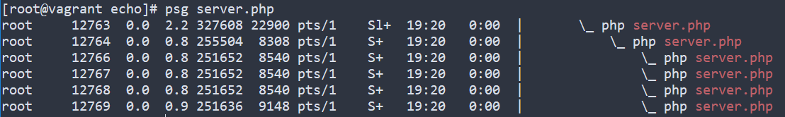

### Swoole 进程模型
多进程模式的框架（可以类比 Nginx 的进程模型）
启动一个 Swoole 应用的时候，会创建如下进程
1. 一个 Master 进程
2. 一个 Manager 进程
3. n 个 Worker 进程
4. m 个 TaskWorker 进程
所以是 2 + n + m 个进程

```/echo/server.php``` worker_num 设为 4, 可以在服务器中查到进程数如下所示：


进程模型图如下：


Master 主进程，会创建 Manager 进程、Reactor 线程等工作进/线程
- Reactor 线程实际运行 epoll 实例，用于 accept 客户端连接以及接收客户端数据
- Manager 进程为管理进程，创建/管理所有的 Worker 进程和 TaskWorker 进程
